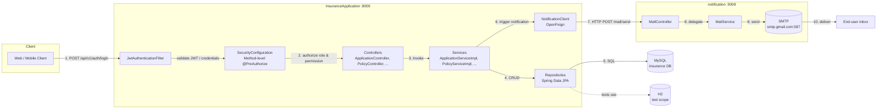
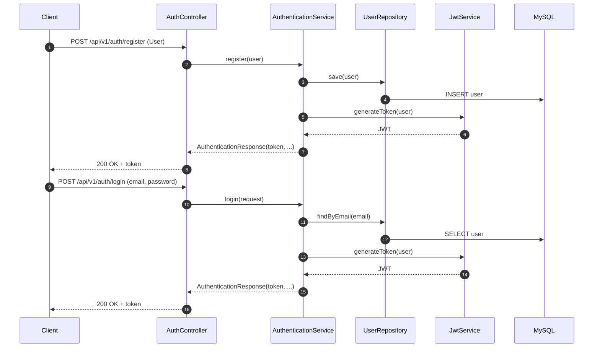
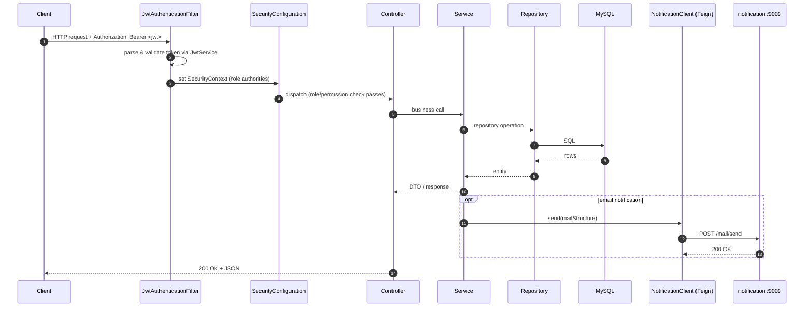
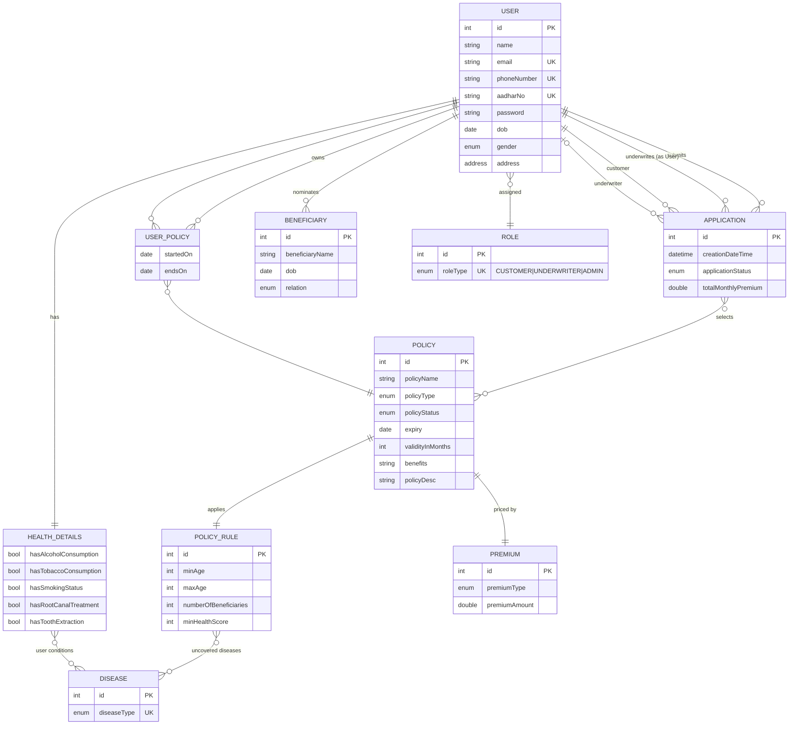

# Insurance Application

A full-featured insurance management system built with Spring Boot 3.2.4 and Java 17. The project is structured as a multi-module Maven workspace comprising a core insurance service and a notification microservice.

## Modules

| Module | Description | Port |
| --- | --- | --- |
| `InsuranceApplication` | Core insurance domain service (auth, users, policies, applications, beneficiaries, diseases, roles, underwriters, admins) | `8000` |
| `notification` | Standalone notification microservice that sends transactional emails via SMTP | `9009` |

## Architecture

- **Framework:** Spring Boot 3.2.4, Spring Security (JWT), Spring Data JPA, Spring AOP
- **Language:** Java 17
- **Build:** Maven (wrapper included via `mvnw`)
- **Persistence:** MySQL (production) / H2 (tests)
- **Inter-service communication:** OpenFeign (`InsuranceApplication` -> `notification`)
- **API documentation:** springdoc-openapi (Swagger UI)
- **Email:** Spring Mail (`notification` service)
- **Containerization:** Docker (provided for `InsuranceApplication`)
- **Testing:** JUnit 5, AssertJ, Spring Test, Spring Security Test

## Domain Model

The core service manages the following entities:

- `User` and `Role` with permission-based access control (`CUSTOMER`, `UNDERWRITER`, `ADMIN`)
- `Policy`, `PolicyRule`, `Premium`
- `Application` (insurance applications by customers)
- `Beneficiary`
- `Disease` and `HealthDetails`
- `Address`, `UserPolicy`

Enums live under `com.java.insurance.app.models.enums` and cover `ApplicationStatus`, `DiseaseType`, `Gender`, `Permission`, `PolicyStatus`, `PolicyType`, `PremiumType`, `Relation`, `RoleType`.

## Security

- JWT-based authentication (JJWT 0.11.5)
- Stateless session policy
- Custom `JwtAuthenticationFilter`, `JwtService`, `SecurityConfiguration`
- Method-level security enabled via `@EnableMethodSecurity`
- Role/permission mapping in `RoleType`

## API Surface

Base URL: `/api/v1`

- `POST /api/v1/auth/register` - Register a new user
- `POST /api/v1/auth/login` - Authenticate and receive a JWT
- `GET/POST/PUT/DELETE /api/v1/users/**` - User management
- `GET/POST/PUT/DELETE /api/v1/admin/**` - Admin operations
- `GET/POST/PUT/DELETE /api/v1/roles/**` - Role management
- `GET/POST/PUT/DELETE /api/v1/policies/**` - Policy management
- `GET/POST/PUT/DELETE /api/v1/applications/**` - Insurance applications
- `GET/POST/PUT/DELETE /api/v1/beneficiaries/**` - Beneficiary management
- `GET/POST/PUT/DELETE /api/v1/diseases/**` - Disease catalog
- `GET/POST/PUT/DELETE /api/v1/underwriters/**` - Underwriter workflows

Interactive docs (when running): `http://localhost:8000/swagger-ui.html`

## Diagrams

### Data Flow

End-to-end request flow for a typical authenticated operation (for example, creating an insurance application) and the email side-channel.



#### Authentication flow



#### Request lifecycle (authenticated call)



### Entity-Relationship Diagram

The core service persists the following entities. Address is `@Embeddable` into User, so it has no independent table.



Legend: `||--||` one-to-one, `||--o{` one-to-many, `}o--o{` many-to-many, `}o--||` many-to-one. `USER_POLICY` uses a composite key `(user_id, policy_id)`.

## Cross-cutting Concerns

- **AOP Logging:** `com.java.insurance.app.logging.LoggingAspect` logs service-layer activity via pointcuts in `PointCutConstant`.
- **Exception Handling:** Centralized in `InsuranceExceptionHandler` returning `ErrorResponse` payloads with codes from `ErrorCode`.
- **Validation:** Jakarta Bean Validation on request DTOs and entities.

## Project Structure

```
Insurance-Application/
|-- InsuranceApplication/        # Core service
|   |-- pom.xml
|   |-- Dockerfile
|   |-- mvnw / mvnw.cmd
|   `-- src/
|       |-- main/java/com/java/insurance/
|       |   |-- InsuranceAppApplication.java
|       |   `-- app/
|       |       |-- config/         # Security & Swagger config
|       |       |-- constants/      # URL & message constants
|       |       |-- controllers/    # REST controllers
|       |       |-- exception/      # Custom exceptions & handlers
|       |       |-- logging/        # AOP logging
|       |       |-- mail/           # Feign client to notification service
|       |       |-- models/         # JPA entities & enums
|       |       |-- payload/        # Auth DTOs
|       |       |-- repositories/   # Spring Data repositories
|       |       `-- services/       # Service interfaces & implementations
|       `-- test/                   # JUnit tests (controller, repo, exception, service)
|
`-- notification/                  # Notification microservice
    |-- pom.xml
    |-- mvnw / mvnw.cmd
    `-- src/
        |-- main/java/com/java/Insurance/notification/
        |   |-- NotificationApplication.java
        |   |-- controller/   # Mail controller
        |   |-- model/        # MailStructure DTO
        |   `-- service/      # MailService
        `-- test/
```

## Prerequisites

- Java 17+
- Maven 3.8+ (or use the bundled `mvnw` / `mvnw.cmd`)
- MySQL 8.x (optional - tests use H2)
- Docker (optional, for containerized runs)

## Configuration

### `InsuranceApplication/src/main/resources/application.properties`

| Property | Env Variable | Default |
| --- | --- | --- |
| Server port | `PORT` | `8000` |
| MySQL host | `MYSQL_HOST` | `localhost` |
| MySQL port | `MYSQL_PORT` | `3306` |
| MySQL database | `MYSQL_DB` | `insurance` |
| MySQL user | `MYSQL_USER` | `root` |
| MySQL password | `MYSQL_PASSWORD` | (set me) |
| Show SQL | `SHOW_SQL` | `true` |
| DDL auto | `DDL_AUTO` | `update` |

### `notification/src/main/resources/application.properties`

- SMTP host: `smtp.gmail.com:587`
- Update `spring.mail.username` / `spring.mail.password` with valid credentials (or supply via env vars / external config).

## Build & Run

### Core service

```bash
cd InsuranceApplication
./mvnw clean package           # build
./mvnw spring-boot:run         # run on :8000
```

### Notification service

```bash
cd notification
./mvnw clean package
./mvnw spring-boot:run         # run on :9009
```

### Docker (core service)

```bash
cd InsuranceApplication
docker build -t insurance-app .
docker run -p 8000:8000 insurance-app
```

## Testing

```bash
# Core service tests (uses H2)
cd InsuranceApplication && ./mvnw test

# Notification service tests
cd notification && ./mvnw test
```

Test coverage includes controllers, repositories, exception handlers, and the auth flow.

## Notifications

`InsuranceApplication` calls the `notification` service via an OpenFeign client (`NotificationClient`) to send emails. The notification service exposes a mail endpoint and uses Spring Mail under the hood.

## License

Proprietary - All Rights Reserved.

Copyright (c) Abhishek Shukla. This repository is private and confidential. Unauthorized copying, modification, distribution, or use of this code, via any medium, is strictly prohibited without the prior written permission of the author.
